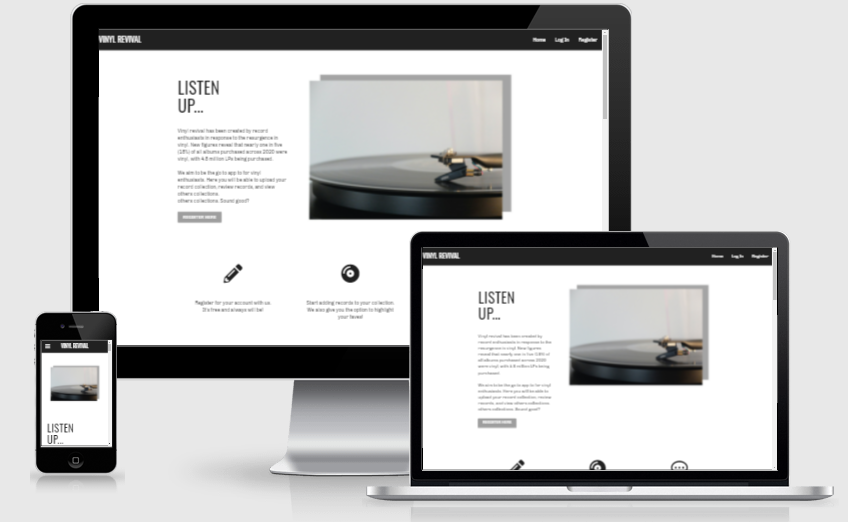
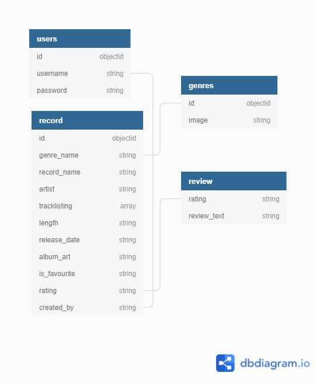
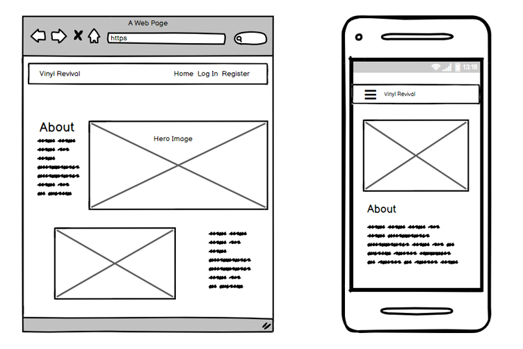

# Vinyl Revival 
## MS3 Code institute project 




Vinyl Revival has been created for my MS3 project with the code institute. Users of the website will be able to register, create a profile and upload their record collection. In addition they will be able to view other records
within the community collection and search records that have been uploaded. The website will build upon existing skills within HTML, CSS and 
Javascript, and utilize new skills learned within Python, Jinja, using the 
Flask framework and Mongodb.


Please [click here](https://vinyl-revival-project.herokuapp.com) to view the website.

### Index

- [Ux](#ux)
- [Features](#features)
- [Resources](#resources)
- [Testing](#testing)
- [Problems and solutions](#problems-and-solutions)
- [Deployment](#deployment)
- [Credits](#credits)
- [Acknowledgements](#acknowledgements)


## UX
 
### Aims

**Site owner's goal**

To build a community where vinyl is celebrated and can be reviewed. 

**External user’s goal** 

Use the website to share vinyl collections and leave reviews on other collections.


 
#### User Stories
As a user I want to be able to:


> -  *Use the site with ease on mobile, tablet and pc devices.*
> -  *View records uploaded by the community*.
> -  *Add my favourite vinyl records to the website*
> -  *View my vinyl collection on my profile page.*
> - *Highlight which records are favourites.*
> - *Search records within the database.*


As an Admin user I want to be able to:


> -  *Add vinyl records to my own profile page.*
> -  *Add, edit and delete genres of music.*


### Skeleton

#### Database

The db will consist of four collections, users, record, genres and review.

* The review collection was created to provide more indepth reviews of records.
Due to time constraints rating was used instead. I would like to expand on
this in the future to provide written reviews. 


 

#### Wireframes

Wireframes have been created using a mobile first approach. 
Please [click here](readmedocumentation/pdf/wireframes.pdf) to view the PDF showing full wireframes for the site. 





### Surface
I have taken on inspiration from gaming websites such as the Oculus website. I feel the simple colour scheme
of black, white and grey makes for a modern and clean look for the website. 


**Colours**

White space has been used to provide a sense of calm,

I have used (#ffffff) for my main text to make the typography contrasting and clear to the user against the white background. 
and have used (#000000) and (#ffffff) for my text within the footer section to stand out against the grey background. 

**Typography**


**Heading text**

The font Oswald has been used for headings - this font works well as it is bold, modern and contrats well against the body text. 

**Body text**

Chivo has been used for the body text, this sans serif font is clearly legible to the user, especially on mobile devices. It also contrasts nicely
against the heading font.


**Imagery**

Unsplash has been used for all the photography within the website. I chose modern images that would fit with
the colour palette and provide a modern feel to the website. 

**Cards**

I have decided to use the card component within Materialize to display the data from the records. I feel this works well and emulates physically turning over a record to see the tracklisting and it can also showcase the vinyl album artwork well.


---
## Features

### Current features

- **Registration page** where users are able to register for a new account for the website.
- **Log in Page** where users are able to log in.
- **Profile page:** users will be directed to their profile page upon log in. This displays all of the records
they have uploaded to the website. 
- **Search feature** users are able to search records uploaded by all users to the website.
- **Footer:** with social media links to enable easy access to other social media sites which can offer more information to the user.

### Features to be added

These are features that lie out of the current scope, but could be added added at a later date.

- Link up to spotify API so tracks from albums could be listened to.
- Music videos added to vinyl album pages.
- A blog highlighting albums from the community vinyl collection.


## Technologies 

The following technologies have been used in the project.

**Languages**

- HTML 

- CSS

- Javascript

- Python

## Libraries and Frameworks

* [Materialize](https://materializecss.com
) a modern responsive CSS framework based on Material Design by Google.
- [Flask](https://flask.palletsprojects.com/) - a micro web framework written in Python
- [Jinja](https://jinja.palletsprojects.com/en/3.0.x/) - a web template engine for the Python programming language

**Integrations**
- [Font Awesome](https://fontawesome.com/) - used for icons within the footer bar. 

- [Google fonts](https://fonts.google.com/) - A library of 1005 free licensed font families. 


**IDE, Version control, Repository storage**

* [Git](https://git-scm.com/) - Distributed Version Control tool to store * versions of files and track changes.

* [GitPod](https://gitpod.io/) - Workspace IDE.

* [GitHub](https://github.com/) - Hosting service used to manage my Git repositories.


## Resources

The following resources have been used within the project.


* [Adobe Photoshop](https://www.adobe.com/uk/products/photoshop.html) for editing image sizes and editing the hero image.

* [w3schools.com](https://www.w3schools.com/) - resource to improve general knowledge of HTML and CSS and Javascript

* [Balsamiq](https://balsamiq.com/) - used for the creation of wireframes during UI design stage. 

* [Stack Overflow](https://stackoverflow.com/) - general resource used for technical queries.

* [Chrome DevTools](https://developers.google.com/web/tools/chrome-devtools) - used to debug HTML and CSS and to view responsiveness on different screen sizes.

* [dbdiagram.io](https://www.youtube.com/watch?v=T-VQUKeSU1w) - Database Relationship Diagrams Design Tool

## Testing

All testing for the website can be found [here](/static/testing/TESTING.md)


## Deployment

## Cloning the repository
To clone the repository the following steps need to be taken.

1. On GitHub, navigate to the main page of the repository.
2. Click the green Clone or download Button under the repository name.
3. Open Git Bash. 
4. Change the current working directory to the location where you want the cloned directory. 
5. Type git clone, and then paste the URL you copied earlier. 
6. Press enter to create the local clone.

### Run locally
1. Type pip3 install -r requirements.txt in the CLI to install the modules listed in the requirements.txt file.
2.  Create a database in mongodb and copy the following collections "users" "genres" "record" "review"
3. In the root directory of your project, create an env.py file and add it to your .gitignore file.This is where sensitive information will be held so we need to ensure it isn't pushed to the repo.
Copy the content below to link up the database.

```
import os

os.environ.setdefault("IP", "0.0.0.0")
os.environ.setdefault("PORT", "5000")
os.environ.setdefault("SECRET_KEY", "secret_key")
os.environ.setdefault("MONGO_URI", "mongo_uri")
os.environ.setdefault("MONGO_DBNAME", "mongo_dbname")
```


### Deploying to Heroku

1. Use command pip3 freeze --local> requirements.txt to create a requirements
file that collects all of the required dependancies. 
2. Within the root directory create a procfile and enter web: python app.py > Procfile
Enter the command pip3 freeze > requirements.txt
3. Push the requirements.txt and Procfile to the repository. 
4. Log in to Heroku and click the link for create a new app. Ensure the name
for the app is unique.
5. Within Heroku locate the Deploy tab. Within the deployment method click on Github.
6. Search for the repository name and click connect.
7. Locate the settings tab and click Reveal Config Vars
8. Add the following variables: 
- IP: 0.0.0.0.
- PORT: 5000
-SECRET_KEY
- MONGO_URI
- MONGO_DBNAME: vinyl_collector
9. Click on deploy branch. After it is built you will see the message "Your App was successfully deployed"
10. Click "view to launch the app" 


## Credits
